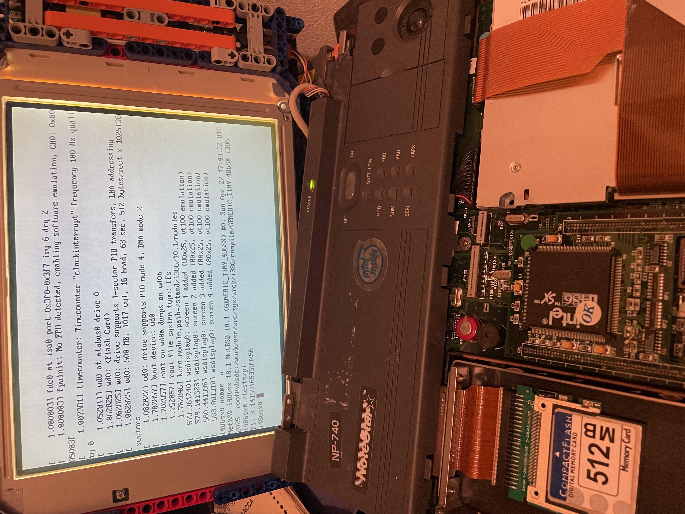

# FPU Emulation Revival for i486SX on NetBSD



This retro-computing project restores support for x87 floating-point unit (FPU) emulation in the NetBSD kernel,
targeting legacy 486SX-class processors without hardware FPUs. It brings back the original `MATH_EMULATE` option into
NetBSD 10.x and beyond, as well as reverts and reworks the changes introduced in
[commit dfe83e0](https://github.com/NetBSD/src/commit/dfe83e08ca9688dd195a43113e7bc7c58fcdd14a), which removed FPU
emulation support from the kernel.

### Disclaimer

This project is a work in progress and may contain bugs or incomplete functionality. Use at your own risk.
The author is not responsible for any issues caused by its use.

### Notes

- `fyl2x` seems to work properly on FPU, but when executed from `libc`, `log` functions bring incorrect results
- Some operations have hard-to-detect issues with precision

## x87 FPU Emulated Instructions

### 🧠 Control & Initialization

| Instruction | Status   | Description                                     | Opcode     | Example              |
| ----------- | -------- | ----------------------------------------------- | ---------- | -------------------- |
| `fninit`    | ✅ OK   | Initialize FPU                                  | `9B DB E3` | `fninit`             |

### 📤 Load to FPU Stack

| Instruction | Status   | Description                                     | Opcode     | Example              |
| ----------- | -------- | ----------------------------------------------- | ---------- | -------------------- |
| `fld`       | ✅ OK   | Load floating-point value                       | `D9 /0`    | `fld st(1)`          |
| `fldt`      | ✅ OK   | Load 80-bit extended precision                  | `DB /5`    | `fldt [mem]`         |
| `filds`     | ✅ OK   | Load integer (short)                            | `DB /0`    | `filds [mem]`        |
| `fildl`     | ✅ OK   | Load long integer                               | `DB /A`    | `fildl [mem]`        |

### 📤 Store from FPU Stack

| Instruction | Status   | Description                                     | Opcode     | Example              |
| ----------- | -------- | ----------------------------------------------- | ---------- | -------------------- |
| `fstps`     | ✅ OK   | Store and pop single precision                  | `D9 /3`    | `fstps [mem]`        |
| `fstpt`     | ✅ OK   | Store 80-bit extended precision & pop           | `DB /7`    | `fstpt [mem]`        |

### ➕➖✖️➗ Arithmetic Operations

| Instruction | Status   | Description                                     | Opcode     | Example              |
| ----------- | -------- | ----------------------------------------------- | ---------- | -------------------- |
| `fadd`      | ✅ OK   | Add floating-point values                       | `D8 /0`    | `fadd st(1), st`     |
| `faddl`     | ✅ OK   | Add long double from memory                     | `DA /0`    | `faddl [mem]`        |
| `fsub`      | ✅ OK   | Subtract floating-point values                  | `D8 /4`    | `fsub st(1), st`     |
| `fsubp`     | ✅ OK   | Subtract with pop                               | `DE /5`    | `fsubp st(1), st(0)` |
| `fmul`      | ✅ OK   | Multiply floating-point values                  | `D8 /1`    | `fmul st(1), st`     |
| `fdiv`      | ✅ OK   | Divide floating-point values                    | `D8 /6`    | `fdiv st(1), st`     |
| `fdivp`     | ✅ OK   | Divide with pop                                 | `DE /7`    | `fdivp st(1), st(0)` |
| `fscale`    | ✅ OK   | Scale ST(0) by ST(1)                            | `D9 FD`    | `fscale`             |

### 🔍 Comparison

| Instruction | Status   | Description                                     | Opcode     | Example              |
| ----------- | -------- | ----------------------------------------------- | ---------- | -------------------- |
| `fcom`      | ✅ OK   | Compare floating-point values                   | `D8 /2`    | `fcom st(1)`         |
| `fucom`     | ✅ OK   | Unordered compare ST(0) with ST(i)              | `DD E0+i`  | `fucom st(1)`        |
| `fucomp`    | ✅ OK   | Unordered compare and pop                       | `DD E8+i`  | `fucomp st(1)`       |
| `ftst`      | ✅ OK   | Compare ST(0) with 0.0                          | `D9 E4`    | `ftst`               |

### 🔁 Stack Manipulation & Modification

| Instruction | Status   | Description                                     | Opcode     | Example              |
| ----------- | -------- | ----------------------------------------------- | ---------- | -------------------- |
| `fxch`      | ✅ OK   | Exchange ST(0) with ST(i)                       | `D9 C8+i`  | `fxch st(1)`         |
| `fchs`      | ✅ OK   | Change sign of ST(0)                            | `D9 E0`    | `fchs`               |
| `fabs`      | ✅ OK   | Absolute value of ST(0)                         | `D9 E1`    | `fabs`               |
| `frndint`   | ✅ OK   | Round ST(0) to integer                          | `D9 FC`    | `frndint`            |

### 📈 Logarithmic and Special Math Operations

| Instruction  | Status   | Description                                        | Opcode     | Example              |
| ------------ | -------- | -------------------------------------------------- | ---------- | -------------------- |
| `fyl2x`      | ✅ OK   | Compute y × log₂(x) (ST(1) × log₂(ST(0))) and pop  | `D9 F1`    | `fyl2x`              |
| `fyl2xp1`    | ❌ N/A  | Compute y × log₂(x+1) and pop                      | `D9 F9`    | `fyl2xp1`            |
| `fxtract`    | ❌ N/A  | Extract: ST(0) → ST = significand, ST+1 = exponent | `D9 F4`    | `fxtract`            |
| `f2xm1`      | ✅ OK   | Compute 2^x - 1 for ST(0)                          | `D9 F0`    | `f2xm1`              |
| `fpatan`     | ❌ N/A  | Compute arctangent(ST(1)/ST(0)) and pop            | `D9 F3`    | `fpatan`             |
| `fsqrt`      | ❌ N/A  | Compute square root of ST(0)                       | `D9 FA`    | `fsqrt`              |

## Installation

- Read [Chapter 32. Obtaining the sources](https://www.netbsd.org/docs/guide/en/chap-fetch.html)
- Read [Chapter 34. Compiling the kernel](https://www.netbsd.org/docs/guide/en/chap-kernel.html)
- Add the repository contents under `/src/sys/arch` on NetBSD 10.x machine, then run:

``` sh
$ cd /usr/src/sys/arch/i386/conf/
$ vi GENERIC_TINY_486SX# or GENERIC_PS2TINY_486SX or create your own kernel configuration with "options MATH_EMULATE"
$ config GENERIC_TINY_486SX
$ cd ../compile/GENERIC_TINY_486SX
$ make depend
$ make

# If everythig good, install the new kernel under root:
# mv /netbsd /netbsd.old
# mv netbsd /
```

## Prebuilt drive image

It will appear eventually under [Releases](https://github.com/mezantrop/i486SX_soft_FPU/releases)

## Contacts

If you have an idea, a question, or have found a problem, feel free to open an issue or contact me directly:
[Mikhail Zakharov](mailto:zmey20000@yahoo.com).

My changes to the original code by Linus Torvalds, William "Bill" Jolitz, and NetBSD are licensed under
the BSD-2-Clause license.
